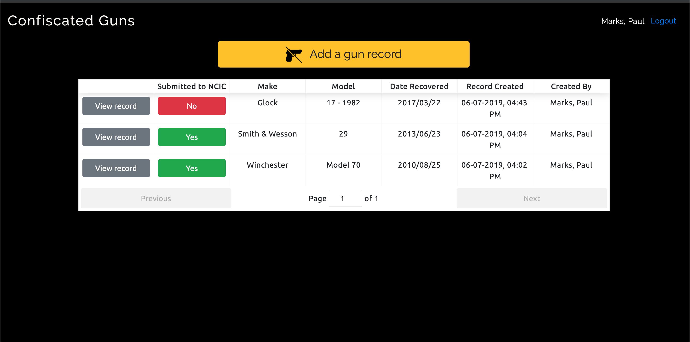

# Confiscated Guns

Confiscated Guns is used by the Bureau of Police at the City of Pittsburgh to track confiscated firearms.  The federal government mandates that data on confiscated guns be reported to the FBI through a standardized format.  Confiscated Guns provides an internal interface for Police personnel to collect and define all necessary data required by the FBI, and a tracking mechanism to ensure that all gun records are being reported properly.

Confiscated Guns uses Sharepoint as a data store, and interfaces with the [365-proxy](https://github.com/CityofPittsburgh/365-api).



## A note on boilerplate

The bones of Confiscated Guns are shared across all client applications developed by Paul Marks for the City of Pittsburgh.  For more in-depth documentation on the structure,  design choices, authentication flow, and installation procedures for this application, please see the documentation for the [boilerplate](https://github.com/CityofPittsburgh/react-typescript-boilerplate).

This README will focus only on the components of this application that are unique to Confiscated Guns.

## Structure
    ...
    app
    ├── src                         
        ├── components        
            |── gunRecords      # Returns list of gun records
            |── newGun          # Form for creating a new gun record
        ├── store                   
            |── guns            # Store of all gun records

## Running Locally

### Prerequisites

* [Node.js](https://nodejs.org) - JS runtime
* .env - See .env.example for all required secrets

### Installation
```
git clone https://github.com/CityofPittsburgh/confiscated-guns
cd confiscated-guns
// first, install dependencies for the server
npm install
// then, install dependencies for the client
cd app
npm install
// to run the app locally and bypass auth
npm start
// to bundle the app for deployment
npm run build
// to run the app from the minified build, with auth workflow
cd ..
node server.js
```

## Deployment

Both staging and production services are hosted in Azure.  Application is deployed directly from github, and can be triggered either (a) through the Azure GUI, (b) through the [CLI](https://docs.microsoft.com/en-us/cli/azure/webapp/deployment/source?view=azure-cli-latest#az-webapp-deployment-source-sync), or (c) through the [proxy service](https://github.com/CityofPittsburgh/azure-proxy).

For complete documentation on the azure environment, see [here](https://github.com/CityofPittsburgh/all-things-azure.git).

## License

This project is licensed under the MIT License - see the [LICENSE.md](LICENSE.md) file for details